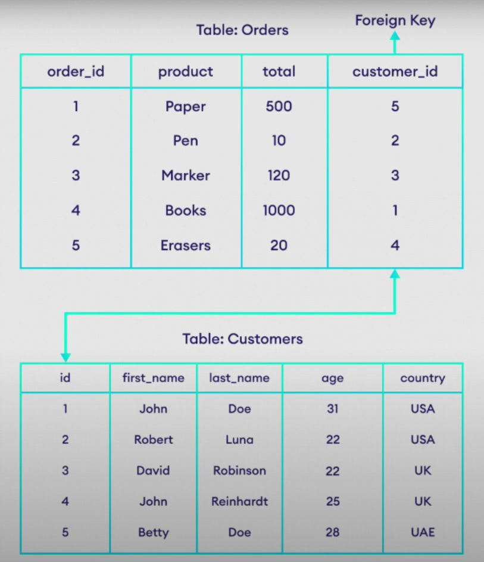

1. What is DATABASE?

- Database is a collection of
  data stored in a format that
  can easily be accessed.

1. OPERATIONS

- INSERT
- SELECT
- UPDATE
- DELETE

1. SQL

- (Structured Query Language)
  SQL is a standard language
  for database creation and
  manipulation.

1. (Database Management System)

- DBMSis a software or tool that we use to manage our data.

##### Type of DBMS

- Sql
- NoSQl (Relational)

##### RDBMS

- Relational Database Management System

##### Data TYPES

- A database data type refers to the format of data storage that can hold a distinct type

##### MySQL Data TYPES

|  |
| -------------------------------- |

##### Mysql Workbench installation

##### XAAMP

#### Login Through shell

```
mysql -h localhost -u root
```

#### Create and Drop Database

- sql is not case sensitive langauge

```
CREATE DATABASE mydb;
```

- Use to create database

```
DROP DATABASE mydb;
```

- Use to remove/Delete database

---

#### Tables (Create , Alter, Drop)

- Tables are collection of rows and columns
- To use database

```
use mydb;
```

- Create table in database

```
CREATE TABLE students(
   name varchar(225),
   father_name varchar(225),
   city varchar(50),
   date_of_birth date
);
```

- Rename table

```
 RENAME TABLE students TO class_students;
```

- Delete table

```
DROP TABLE students;
```

- Alter Table it is used

1. To add new column
1. modify existing column
1. delete any colume

- add new column

```
ALTER TABLE students add class_name varchar(255);
```

- delete column

```
ALTER TABLE students DROP COLUMN  class_name;
```

- MODIFY column

```
ALTER TABLE students MODIFY COLUMN city varchar(255);
```

- change position of column

```
ALTER TABLE students MODIFY COLUMN date_of_birth date AFTER father_name;
```

- adding colume after any column

```
ALTER TABLE students ADD COLUMN mother_name varchar(255)
AFTER father_name;
```

#### Insert Query

- create new table after drop previous student table

```
 CREATE TABLE students(
     student_id int,
     student_name varchar(255),
     father_name varchar(255),
     marks float(10,2),
     date_of_birth date
     );
```

- Inserting data

```
INSERT INTO students (student_id, student_name, father_name, marks, date_of_birth) VALUES (1,"Nabin", "Shankar", 78.36, "1997-09-10");

INSERT INTO students (student_id, student_name, father_name, marks, date_of_birth) VALUES (2, "Hemant", "hemnath", 89.33, "1988-09-10");
```

- Nth-Number of Query / Multiple Query

```
 INSERT INTO students (student_id, student_name, father_name) VALUES(3, "Joy","smith"),
     (4, "John", "Don")
     ;
```

#### SELECT QUERY

- select query is help to fetch data from database and show to user.

- Show all tables

```
 SELECT * FROM students;

+------------+--------------+-------------+-------+---------------+
| student_id | student_name | father_name | marks | date_of_birth |
+------------+--------------+-------------+-------+---------------+
|          1 | Nabin        | Shankar     | 78.36 | 1997-09-10    |
|          2 | Hemant       | hemnath     | 89.33 | 1988-09-10    |
|          3 | Joy          | smith       |  NULL | NULL          |
|          4 | John         | Don         |  NULL | NULL          |
+------------+--------------+-------------+-------+---------------+
```

- Another Way with specific student_name and father_name.

```
SELECT student_name, father_name FROM students;

+--------------+-------------+
| student_name | father_name |
+--------------+-------------+
| Nabin        | Shankar     |
| Hemant       | hemnath     |
| Joy          | smith       |
| John         | Don         |
+--------------+-------------+
```

#### WHERE CLAUSE

- if i need student data which id have 4 lets see whats the query

```
SELECT * FROM students WHERE student_id=4;

+------------+--------------+-------------+-------+---------------+
| student_id | student_name | father_name | marks | date_of_birth |
+------------+--------------+-------------+-------+---------------+
|          4 | John         | Don         |  NULL | NULL          |
+------------+--------------+-------------+-------+---------------+
```

- number of students marks having Greater than 50

```
SELECT * FROM students WHERE marks >=50;

+------------+--------------+-------------+-------+---------------+
| student_id | student_name | father_name | marks | date_of_birth |
+------------+--------------+-------------+-------+---------------+
|          1 | Nabin        | Shankar     | 78.36 | 1997-09-10    |
|          2 | Hemant       | hemnath     | 89.33 | 1988-09-10    |
+------------+--------------+-------------+-------+---------------+
```

- Find Date of Birth

```
 SELECT * FROM STUDENTS WHERE date_of_birth = "1997-09-10";

+------------+--------------+-------------+-------+---------------+
| student_id | student_name | father_name | marks | date_of_birth |
+------------+--------------+-------------+-------+---------------+
|          1 | Nabin        | Shankar     | 78.36 | 1997-09-10    |
+------------+--------------+-------------+-------+---------------+
```

- Students marks greater than 70

```
SELECT student_name FROM students WHERE marks >70;

+--------------+
| student_name |
+--------------+
| Nabin        |
| Hemant       |
+--------------+
```

#### AND, OR, NOT, OPERATORS

- Data

```
select * from students_info;

+------------+---------------+--------------+-------+---------------+-----------+
| student_id | student_name  | father_name  | marks | date_of_birth | city_name |
+------------+---------------+--------------+-------+---------------+-----------+
|          1 | Nabin         | Gopal        | 78.99 | 1997-09-10    | KTM       |
|          2 | Rakesh        | Manoj        | 59.00 | 1998-10-10    | Bikaner   |
|          3 | John          | Smith        | 52.00 | 1998-06-11    | Delhi     |
|          4 | Joy           | Don          | 68.20 | 1998-01-10    | Delhi     |
|          5 | Rohan Singh   | Ritesh Singh | 49.00 | 1999-10-12    | Mumbai    |
|          6 | Yogesh Pareek | Kamal Pareek | 90.00 | 2000-07-01    | Mumbai    |
|          7 | Sairaj        | Timilsina    | 88.96 | 1986-05-11    | Dang      |
+------------+---------------+--------------+-------+---------------+-----------+
```

- **AND Operator**

- Students Only From Delhi

```
select * from students_info where city_name="Delhi";
+------------+--------------+-------------+-------+---------------+-----------+
| student_id | student_name | father_name | marks | date_of_birth | city_name |
+------------+--------------+-------------+-------+---------------+-----------+
|          3 | John         | Smith       | 52.00 | 1998-06-11    | Delhi     |
|          4 | Joy          | Don         | 68.20 | 1998-01-10    | Delhi     |
+------------+--------------+-------------+-------+---------------+-----------+
```

```
select * from students_info where city_name ="Delhi" and marks >60;

+------------+--------------+-------------+-------+---------------+-----------+
| student_id | student_name | father_name | marks | date_of_birth | city_name |
+------------+--------------+-------------+-------+---------------+-----------+
|          4 | Joy          | Don         | 68.20 | 1998-01-10    | Delhi     |
+------------+--------------+-------------+-------+---------------+-----------+

like wise
select * from students_info where city_name="KTM" and marks >70;

+------------+--------------+-------------+-------+---------------+-----------+
| student_id | student_name | father_name | marks | date_of_birth | city_name |
+------------+--------------+-------------+-------+---------------+-----------+
|          1 | Nabin        | Gopal       | 78.99 | 1997-09-10    | KTM       |
+------------+--------------+-------------+-------+---------------+-----------+
```

- **OR Operator**

- Students from KTM OR Dang

```
select * from students_info where city_name="KTM" or city_name="Dang";
+------------+--------------+-------------+-------+---------------+-----------+
| student_id | student_name | father_name | marks | date_of_birth | city_name |
+------------+--------------+-------------+-------+---------------+-----------+
|          1 | Nabin        | Gopal       | 78.99 | 1997-09-10    | KTM       |
|          7 | Sairaj       | Timilsina   | 88.96 | 1986-05-11    | Dang      |
+------------+--------------+-------------+-------+---------------+-----------+
```

- Students from KTM OR Dang but marks should greater than 80

```
select * from students_info where (city_name="KTM" or city_name="Dang") and marks > 80 ;
+------------+--------------+-------------+-------+---------------+-----------+
| student_id | student_name | father_name | marks | date_of_birth | city_name |
+------------+--------------+-------------+-------+---------------+-----------+
|          7 | Sairaj       | Timilsina   | 88.96 | 1986-05-11    | Dang      |
+------------+--------------+-------------+-------+---------------+-----------+
1 row in set (0.000 sec)

MariaDB [mydb]> select * from students_info where (city_name="KTM" or city_name="Dang") and marks > 70 ;
+------------+--------------+-------------+-------+---------------+-----------+
| student_id | student_name | father_name | marks | date_of_birth | city_name |
+------------+--------------+-------------+-------+---------------+-----------+
|          1 | Nabin        | Gopal       | 78.99 | 1997-09-10    | KTM       |
|          7 | Sairaj       | Timilsina   | 88.96 | 1986-05-11    | Dang      |
+------------+--------------+-------------+-------+---------------+-----------+
```

- **NOT Operator**

```
select * from students_info where not city_name="Delhi";

+------------+---------------+--------------+-------+---------------+-----------+
| student_id | student_name  | father_name  | marks | date_of_birth | city_name |
+------------+---------------+--------------+-------+---------------+-----------+
|          1 | Nabin         | Gopal        | 78.99 | 1997-09-10    | KTM       |
|          2 | Rakesh        | Manoj        | 59.00 | 1998-10-10    | Bikaner   |
|          5 | Rohan Singh   | Ritesh Singh | 49.00 | 1999-10-12    | Mumbai    |
|          6 | Yogesh Pareek | Kamal Pareek | 90.00 | 2000-07-01    | Mumbai    |
|          7 | Sairaj        | Timilsina    | 88.96 | 1986-05-11    | Dang      |
+------------+---------------+--------------+-------+---------------+-----------+
```

#### Update Query

- Update the columns

```
 update students_info set student_name="Suraj", father_name="Surandra" w
here student_id=5;

Output:
select * from students_info;
+------------+---------------+--------------+-------+---------------+-----------+
| student_id | student_name  | father_name  | marks | date_of_birth | city_name |
+------------+---------------+--------------+-------+---------------+-----------+
|          1 | Nabin         | Gopal        | 78.99 | 1997-09-10    | KTM       |
|          2 | Rakesh        | Manoj        | 59.00 | 1998-10-10    | Bikaner   |
|          3 | John          | Smith        | 52.00 | 1998-06-11    | Delhi     |
|          4 | Joy           | Don          | 68.20 | 1998-01-10    | Delhi     |
|          5 | Suraj         | Surandra     | 49.00 | 1999-10-12    | Mumbai    |
|          6 | Yogesh Pareek | Kamal Pareek | 90.00 | 2000-07-01    | Mumbai    |
|          7 | Sairaj        | Timilsina    | 88.96 | 1986-05-11    | Dang      |
+------------+---------------+--------------+-------+---------------+-----------+
```

- Update the marks where id=3 and city_name="Delhi"

```
update students_info set marks=70 where student_id=3 and city_name="Delhi";

select * from students_info;
+------------+---------------+--------------+-------+---------------+-----------+
| student_id | student_name  | father_name  | marks | date_of_birth | city_name |
+------------+---------------+--------------+-------+---------------+-----------+
|          1 | Nabin         | Gopal        | 78.99 | 1997-09-10    | KTM       |
|          2 | Rakesh        | Manoj        | 59.00 | 1998-10-10    | Bikaner   |
|          3 | John          | Smith        | 70.00 | 1998-06-11    | Delhi     |
|          4 | Joy           | Don          | 68.20 | 1998-01-10    | Delhi     |
|          5 | Suraj         | Surandra     | 49.00 | 1999-10-12    | Mumbai    |
|          6 | Yogesh Pareek | Kamal Pareek | 90.00 | 2000-07-01    | Mumbai    |
|          7 | Sairaj        | Timilsina    | 88.96 | 1986-05-11    | Dang      |
+------------+---------------+--------------+-------+---------------+-----------+
```

#### DELETE QUERY

- To Delete all tables

```
DELETE FROM students_info;
```

- delete students info whose id is 5

```
delete from students_info where student_id=5;

 select * from students_info;
+------------+---------------+--------------+-------+---------------+-----------+
| student_id | student_name  | father_name  | marks | date_of_birth | city_name |
+------------+---------------+--------------+-------+---------------+-----------+
|          1 | Nabin         | Gopal        | 78.99 | 1997-09-10    | KTM       |
|          2 | Rakesh        | Manoj        | 59.00 | 1998-10-10    | Bikaner   |
|          3 | John          | Smith        | 70.00 | 1998-06-11    | Delhi     |
|          4 | Joy           | Don          | 68.20 | 1998-01-10    | Delhi     |
|          6 | Yogesh Pareek | Kamal Pareek | 90.00 | 2000-07-01    | Mumbai    |
|          7 | Sairaj        | Timilsina    | 88.96 | 1986-05-11    | Dang      |
+------------+---------------+--------------+-------+---------------+-----------+
```

- Delete students record whose are from delhi or mumbai

```
delete from students_info where city_name="Delhi" or city_name="Mumbai";

select * from students_info;
+------------+--------------+-------------+-------+---------------+-----------+
| student_id | student_name | father_name | marks | date_of_birth | city_name |
+------------+--------------+-------------+-------+---------------+-----------+
|          1 | Nabin        | Gopal       | 78.99 | 1997-09-10    | KTM       |
|          2 | Rakesh       | Manoj       | 59.00 | 1998-10-10    | Bikaner   |
|          7 | Sairaj       | Timilsina   | 88.96 | 1986-05-11    | Dang      |
+------------+--------------+-------------+-------+---------------+-----------+
```

### Constants

#### Primary Key

- create a one table having primary key

```
create table results(
    -> result_id int primary key,
    -> marks float (5,2)
    -> );

insert into it
 insert into results (result_id, marks) value(1,66);

output:
select * from results;
+-----------+-------+
| result_id | marks |
+-----------+-------+
|         1 | 66.00 |
+-----------+-------+

```

- we cannot store null in primary key

```
insert into results (result_id, marks) value(null,66);
ERROR 1048 (23000): Column 'result_id' cannot be null
```

- Primary key cannot be dublicate

```
insert into results (result_id, marks) value(2,66);

insert into results (result_id, marks) value(2,66);
ERROR 1062 (23000): Duplicate entry '2' for key 'PRIMARY'
```

- How to create existing colume make a primary key

```
alter table students_info add constraint primary key(student_id);

lets insert value
 insert into students_info (student_id, student_name, father_name, marks, date_of_birth, city_name) value(3, "rahul", "subash", 88, "1994-11-20", "Sadobato");

Output:
select * from students_info;
+------------+--------------+-------------+-------+---------------+-----------+
| student_id | student_name | father_name | marks | date_of_birth | city_name |
+------------+--------------+-------------+-------+---------------+-----------+
|          1 | Nabin        | Gopal       | 78.99 | 1997-09-10    | KTM       |
|          2 | Rakesh       | Manoj       | 59.00 | 1998-10-10    | Bikaner   |
|          3 | rahul        | subash      | 88.00 | 1994-11-20    | Sadobato  |
|          7 | Sairaj       | Timilsina   | 88.96 | 1986-05-11    | Dang      |
+------------+--------------+-------------+-------+---------------+-----------+

lets insert once again to student_id having 3

 insert into students_info (student_id, student_name, father_name, marks, date_of_birth, city_name) value(3, "rahul", "subash", 88, "1994-11-20", "Sadobato");
ERROR 1062 (23000): Duplicate entry '3' for key 'PRIMARY'


```

#### Auto Increment

- for auto increment create table

```
create table payments(
    -> payment_id int primary key auto_increment,
    -> amount decimal (10,2)
    -> );

insert amount only
insert into payments (amount) value(22);

Output:
select * from payments;
+------------+--------+
| payment_id | amount |
+------------+--------+
|          1 |  22.00 |
+------------+--------+


lets insert multiple amount to see auto increment
insert into payments (amount) value(20);
insert into payments (amount) value(16);
insert into payments (amount) value(1000);
insert into payments (amount) value(105.66);

output:
select * from payments;
+------------+---------+
| payment_id | amount  |
+------------+---------+
|          1 |   22.00 |
|          2 |   20.00 |
|          3 |   16.00 |
|          4 | 1000.00 |
|          5 |  105.66 |
+------------+---------+

```

#### NULL and NOT NULL

```
 create table employees(
    -> emp_id int primary key auto_increment,
    -> first_name varchar(255) NOT NULL,
    -> last_name varchar(255) NULL,
    -> salary float (10,2) NOT NULL
    -> );

```

- insert the data

```
insert into employees(first_name, last_name, salary) value(NULL, "Kumar", NULL);
ERROR 1048 (23000): Column 'first_name' cannot be null

ok improve first name
insert into employees(first_name, last_name, salary) value("Suraj", "Kumar", NULL);
ERROR 1048 (23000): Column 'salary' cannot be null


ok improve salary
 insert into employees(first_name, last_name, salary) value("Suraj", "Kumar", 10000);
Query OK, 1 row affected (0.031 sec)


```

- add in existing table

#### DEFAULT

```
 create table users(
    -> user_id int primary key auto_increment,
    -> full_name varchar(50) NOT NULL,
    -> status enum('active', 'inactive', 'blocked') default 'inactive'
    -> );

```

##### Output:

```
 select * from users;
+---------+-----------+----------+
| user_id | full_name | status   |
+---------+-----------+----------+
|       1 | rakesh    | inactive |
+---------+-----------+----------+

```

```
 insert into users(full_name, status) value("rohan", "active");
Query OK, 1 row affected (0.01 sec)

mysql> select * from users;
+---------+-----------+----------+
| user_id | full_name | status   |
+---------+-----------+----------+
|       1 | rakesh    | inactive |
|       2 | rohan     | active   |
+---------+-----------+----------+
```

#### Foreign Key

- Foreign key are used to link two tables

|  |
| -------------------- |

#### Joins (inner, left, right)

#### Aliases

#### IN and BETWEEN OPERATOR

#### Functions

#### Wild card

#### Order by

#### Group by

#### Limit

#### SUB-QUERIES

#### Union

#### Truncate table
